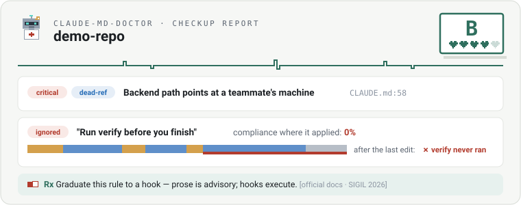

<p align="center">
  
</p>

<h1 align="center">claude-md-doctor</h1>

<p align="center"><b>Give your CLAUDE.md — or AGENTS.md — a checkup.</b><br>
Vitals, lab work, diagnoses, prescriptions — and a backtest of every rule
against your own session history.<br>
No CLAUDE.md yet? The doctor mines your sessions and drafts one — every
line with receipts.</p>

<p align="center">
  
  
  
</p>

<p align="center">
  
</p>

> Linters check the file. Analytics grade your sessions. The doctor
> cross-examines one against the other — and cites receipts.

## Quickstart

As a Claude Code plugin (recommended):

```
/plugin marketplace add agent-clinic/claude-md-doctor
```

then install `claude-md-doctor` from the `/plugin` menu. Or via the
[skills.sh](https://skills.sh) CLI:

```
npx skills add agent-clinic/claude-md-doctor
```

Or bare: copy `skills/claude-md-doctor/` into `~/.claude/skills/`.

Then, in any repo, just ask — *"give my CLAUDE.md a checkup"* — or invoke
directly: `/claude-md-doctor:claude-md-doctor` (bare install:
`/claude-md-doctor`). The report lands in `.claude-md-doctor/report.html`
plus machine-readable `report.json`.

Requires Python 3.9+ (standard library only). Everything runs locally;
nothing leaves your machine.

## What the exam covers

- **Vitals** — effective size vs the official guidance (*"target under 200
  lines per CLAUDE.md file"* — [Claude Code memory docs](https://code.claude.com/docs/en/memory)),
  estimated token cost per session, structure, and pathology markers: stock
  `/init` boilerplate never pruned, emphasis saturation, changelog accretion.
- **Records check** — does everything the file points at exist? Dead file
  paths, paths from a teammate's machine, `@imports` that don't resolve,
  `pnpm`/`make` commands with no matching script, `.claude/rules/` scopes
  that match zero files.
- **Checkable claims** — countable assertions ("2,100 tests across 180
  files", "9 UI components; no dialog") verified against the repo. Inlined
  numbers rot; the doctor catches them.
- **The report** — a single self-contained HTML page: chart grade, chief
  complaint, per-finding evidence, the session-adherence History table, and
  concrete prescriptions, each footnoted with the official doc or study
  behind it (the evidence base lives in [docs/RESEARCH.md](docs/RESEARCH.md)).

It understands the real memory surface: `CLAUDE.md`, `.claude/CLAUDE.md`,
`CLAUDE.local.md`, nested files, `.claude/rules/*.md` (with `paths:` scopes),
`@imports` (depth 4, backtick-aware), `claudeMdExcludes`, ancestor
directories — and it treats the pointer-to-`AGENTS.md` pattern as healthy,
examining the target, while flagging the broken variant (pointer text without
`@`, which Claude Code never actually loads). A repo with an AGENTS.md but no
CLAUDE.md at all gets the doctor's simplest prescription: the official
one-line pointer, so Claude Code stops loading nothing.

## The backtest — check if CLAUDE.md actually works in your sessions

Your own Claude Code session transcripts (`~/.claude/projects/…`) already
record whether past sessions actually followed each rule in your CLAUDE.md.
The doctor decomposes the file into rules and replays them against that
history — per rule, a verdict with receipts:

| Rule | Opportunities | Compliance | Verdict |
|---|---|---|---|
| Never import the legacy API types | 12 | 100% | healthy |
| Run `verify` before you finish | 2 | 0% | **ignored** |
| Never hardcode a colour | 0 | — | inert |

Behind every number: matched excerpts, and for finish-ordering rules a
session-timeline strip showing exactly what ran after the last edit.
Two ideas drive the verdicts ([full taxonomy](docs/TAXONOMY.md)). Every rule
gets an **enforcement class** — the cheapest reliable detector:

| Class | Detector | Binds |
|---|---|---|
| `hook` | gate over tool calls (commands, edits, orderings) — *prevents* | the agent |
| `linter`/`test` | static analysis over the code itself | every agent **and** every human |
| `judge` | LLM audit, post-hoc, with a stated reliability ceiling | audit only |

~70% of real-world directives land in the first two — laws waiting to be
passed. And every violation is **triaged by cause**, because the cause picks
the medicine:

| Cause | What happened | Medicine |
|---|---|---|
| defiance-proven | the agent *echoed the rule*, then broke it | block-mode gate — the reminder already lost |
| defiance | violated in fresh context | warn-hook, then block |
| dilution | drowned late in a heavy session | slim the file, move the rule to point-of-use |
| absence | non-root rule lost to compaction | re-inject; never block |

The arming ladder (reminder → warn → block) is set per rule from its own
violation forensics, and **review-then-arm hook proposals** are written to
the exam folder — nothing is ever installed automatically. Every checkup
also emits a **share-safe card** (grade, hearts, doctor's note — aggregates
only, never a string from your repo) and a **`claude-md-health.svg` badge**
for your README. Matcher fires are
sample-verified before they count, because matchers have bugs; unverified
results are banner-labeled provisional. Research shows agents silently skip
mandated steps while outputs still pass checks; only behavioral evidence
catches that — and it's free, sitting in your transcript history.

Run it on your own repo: the rules you'd bet on being followed are rarely the
ones that are.

## No CLAUDE.md? The doctor writes your chart

Most repos have no memory file at all (18 of the 20 on our own machine).
But their session transcripts already contain the unwritten rulebook, and
the same engine that backtests rules can run in reverse — mine the history,
then validate the checkable candidates against it:

| Signal | Example | Becomes |
|---|---|---|
| repeated corrections | "no, use pnpm not npm" typed in 3 sessions | a rule |
| failed → fixed pairs | `npm test` fails, `pnpm test` works, again | a rule (often a hook) |
| re-discovery | agent reads `package.json` at every session start | a fact, stated once |
| permission denials | you rejected `git push` twice | a "never" rule |
| repeated preambles | the same context paragraph pasted each session | a fact |

Grouped signals survive only with recurrence (≥2 sessions or ≥3
occurrences; re-discovery needs 3 distinct sessions) and carry recency
flags — a preference the repo moved past is marked stale for the judge
pass to decline. Corrections reach the judge ungated (wording varies too
much to group), deduped and capped, and are judged hardest. Each accepted
mechanically-checkable rule is then **replayed through the backtest** for
precise counts. The result is `PROPOSED-CLAUDE.md`: a lean
draft where every line carries its receipt as an HTML comment (stripped at
load, so it costs the adopter nothing), hook-class rules arrive as
review-then-arm guard proposals ("born mechanized"), and the report shows
the re-discovery tax your sessions have been paying. The draft is held to
the same 200-line vitals this tool grades everyone else on — the generator
refuses to prescribe the disease it diagnoses. Nothing is installed and no
CLAUDE.md is written for you — the draft lands in the exam folder
(`.claude-md-doctor/`), and adoption is your move. Repos that *do* have a CLAUDE.md get the
same mining as a **gap analysis**: rules you keep dictating by hand that
the file never says.

## FAQ

**Why does Claude ignore my CLAUDE.md?**
Usually one of three causes, and they need different medicine: *defiance*
(the rule was in context — sometimes literally echoed — and broken anyway),
*dilution* (the rule drowned late in a heavy session), or *absence* (a
non-root rule lost to compaction). The research says this is normal, not
user error: agents violate 57.5% of preference rules even when memory
retrieves them, and perform about half the steps their own instruction
files mandate ([docs/RESEARCH.md](docs/RESEARCH.md)). The backtest tells
you which cause is yours, with the transcript as receipts.

**Can it write my CLAUDE.md for me?**
Yes — from evidence, not from templates. If your repo has no memory file,
the exam switches to intake mode: it mines your local session transcripts
for recurring corrections, failed→fixed commands, re-discovered facts, and
denials, replays the checkable candidates against that same history, and
drafts `PROPOSED-CLAUDE.md` with a receipt on every line. Unlike `/init`,
which reads your file tree, this reads your *behavior* — it only proposes
rules you have demonstrably needed, with recurrence gates and staleness
flags to keep one-off taste out.

**How do I audit my CLAUDE.md or AGENTS.md?**
Install the skill (Quickstart above), then ask in any session: *"give my
CLAUDE.md a checkup"* — audit, review, improve, and lint requests all
route to the same exam. The report lands in `.claude-md-doctor/report.html`.

**How long should a CLAUDE.md be?**
The official guidance says *"target under 200 lines per CLAUDE.md file"*
([memory docs](https://code.claude.com/docs/en/memory)). The doctor
measures your effective loaded size — imports resolved, fences and
comments handled — against that number, and estimates what the file costs
in tokens per session. Length itself is the weakest signal, though; the
strong causal evidence is about pruning content that doesn't change
behavior.

**How is this different from `/insights`, `/doctor`, or the official
claude-md-management plugin?**
They all start from somewhere else. `/doctor` trims content from the file
that Claude could derive from your codebase. `claude-md-improver` grades
the file against your codebase and edits it — its inputs are your
CLAUDE.md files and your repo, never your sessions. `/insights` *does*
read your sessions, and it will suggest CLAUDE.md sections to add, but it
never opens the file you already have.

The difference is direction. Those answer *"what should you write?"* This
one answers *"is what you already wrote doing anything?"* — it takes the
rules that are in your file today, replays each one against your
transcripts, and reports per-rule compliance with counts, receipts, and a
cause when it failed.

A real example from running both: `/insights` suggested adding a rule to
default to staging and never write to production. That repo's CLAUDE.md
already had a section explaining staging versus production. The content
was loaded in every session and the production write happened anyway.
`/insights` cannot see that, because it does not read the file. This tool
exists for that gap. They compose well — one proposes rules, the other
tells you which ones stick.

**Does it count violations from before I added a rule?**
Not when the rule can be dated. Each rule carries an `introduced` date
taken from the memory file's git history, and sessions that ended before
that date are not counted as opportunities for it, so a rule you added
last week is only scored from last week onward. Two limits worth knowing:
the cutoff is currently per session rather than per event, so a session
that straddles the moment you added the rule still counts in full; and
when git cannot date a rule cleanly it stays undated and is scored against
the whole window. Every rule shows how many opportunities its verdict
rests on, so a verdict built on two sessions does not look like one built
on fifty.

**Does my session data leave my machine?**
No. Everything runs locally, stdlib Python only, no telemetry. The share
card and badge are aggregates-only by construction — never a string from
your repo or transcripts — and there's a test asserting exactly that.

## Honesty policy

Every prescription carries an evidence tier — official doc, controlled study,
corpus study, or plainly-labeled heuristic — and the report states the
tensions in the research instead of hiding them (e.g., the one factorial
study found no structural effect of file size in its tested range, while
content pruning has strong causal backing). See
[docs/RESEARCH.md](docs/RESEARCH.md) for the full evidence base — 40+
primary-verified sources.

## Status

The full exam works end to end: static checks + session backtest + cause
triage + enforcement compilation + generative intake mode (no CLAUDE.md →
mine sessions → drafted chart with receipts) + share card/badge + verified
report.
Tested (`python3 -m unittest discover -s tests`), calibrated
against real-world gold-standard files (`python3 fixtures/fetch.py`), and
dogfooded on a real repo — including a clean-context validation run, where a
fresh agent guided only by the skill's own instructions completed every
stage, caught a matcher bug via the built-in verification loop, and found
two real problems the authors had missed. Part of
[agent-clinic](https://github.com/agent-clinic) — checkups for your agent's
config files. Issues and PRs welcome.

## License

MIT. claude-md-doctor is an independent open-source project, not affiliated
with Anthropic. CLAUDE.md and Claude Code are products of Anthropic, PBC.
